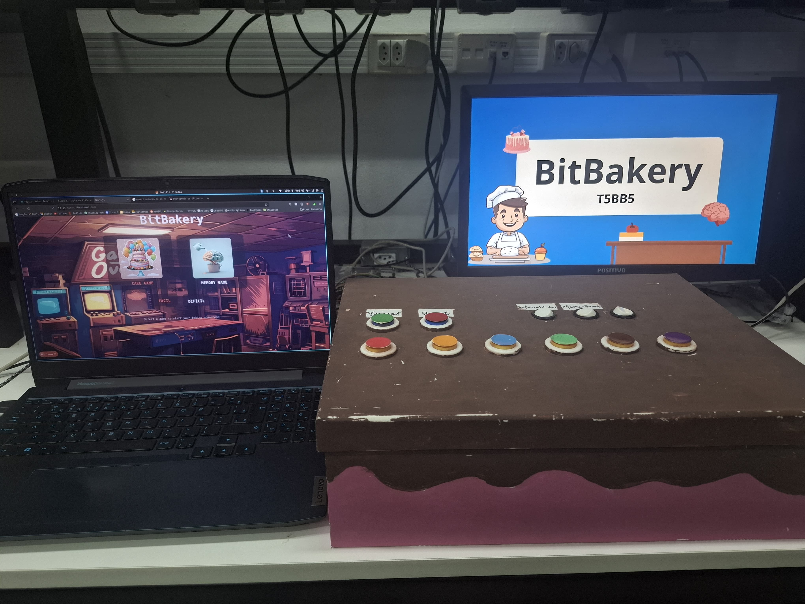

# BitBakery 🍰

## Introdução 📜

Projeto elaborado para a disciplina de PCS3635. O objetivo do projeto é criar jogos sérios para pessoas com TEA (transtorno do espectro autísta) executáveis em uma fpga, usando como base o jogo genius.

O projeto é constituído por dois minigames, um deles sendo o próprio jogo da memória, e outro semelhante ao minigame da fábrica de bolos do jogo purble place, do windows 7. 

Nesse repositório encontram-se tanto códigos da interface (src/), e descrição de hardware utilizadas (verilog/), quanto da comunicação entre ambas (api/).

Na feira de projetos final da disciplina, recebemos a menção honrosa do terceiro lugar.

<div align="center">
    
</div>

## Dependências 🎮

- [node.js](https://nodejs.org/pt) 
- flask 
- flask_cors 
- pygame (opcional)

### Instalação das dependências
```
pip install -r requirements.txt
npm install
```

## Pygame vs. sensores reais ⚔️

Para alternar entre leituras feitas em instrumentos reais e leituras feitas , comente as linhas indicadas nas instruções contidas no arquivo api/analog_server.py

## Execução da interface 🎨
```
npm dev run
```

Após executar o comando acima, o site pode ser acessado em http://localhost:3000/

Em um segundo terminal execute, para executar o servidor dos sensores:
```
py api/analog_server
```